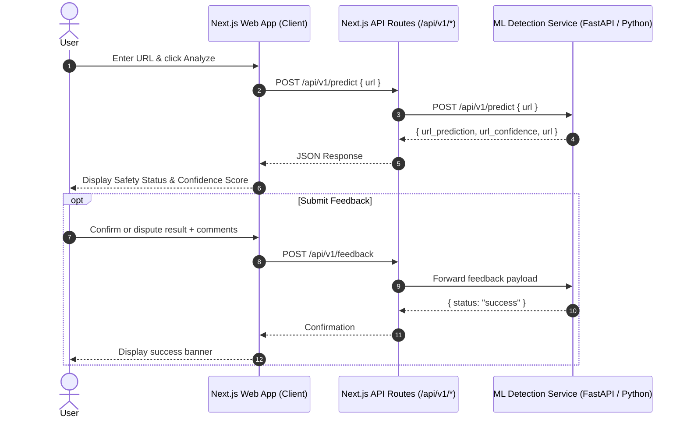

# 🛡️ Phishing Website Detector Web App

[](https://nextjs.org/)
[](https://react.dev/)
[](https://www.typescriptlang.org/)
[](https://tailwindcss.com/)
[](#license)

A modern, responsive web application for real-time phishing website detection. Built with **Next.js 15**, **React 19**, and **Tailwind CSS**, this tool integrates with an AI/machine learning backend to analyze URLs, deliver instant risk assessments, and collect user feedback to continuously improve classification accuracy.

---

## ✨ Features

- **🔍 Real-Time URL Analysis**: Evaluates submitted links and classifies them as **Legitimate** or **Phishing** with confidence percentages.
- **📊 Clear Risk Indicators**: Visual indicators and badges that communicate website safety at a glance.
- **🤝 Active Learning Feedback Loop**: Submit classification validation or corrections (e.g., false positives/negatives) along with optional comments (`POST /api/v1/feedback`) to help retrain and improve detection models.
- **🛡️ Server-Side API Proxy**: Proxies requests through Next.js route handlers (`/api/v1/predict` and `/api/v1/feedback`) to backend services, avoiding cross-origin (CORS) issues and securing backend configurations.
- **💡 Safe Browsing Guidelines**: Built-in security tips to educate users on spotting suspicious domains and verifying SSL/TLS certificates.
- **🎨 Modern, Accessible UI**: Styled with Tailwind CSS and Radix UI primitives with full dark/light theme support.

---

## 🏗️ Architecture & Flow



---

## 🛠️ Tech Stack

- **Framework**: [Next.js 15 (App Router)](https://nextjs.org/)
- **UI Library**: [React 19](https://react.dev/)
- **Styling**: [Tailwind CSS](https://tailwindcss.com/) & [tailwindcss-animate](https://github.com/jamiebuilds/tailwindcss-animate)
- **Component Primitives**: [Radix UI](https://www.radix-ui.com/) (shadcn/ui design system)
- **Icons**: [Lucide React](https://lucide.dev/)
- **Language**: [TypeScript](https://www.typescriptlang.org/)
- **Analytics**: [@vercel/analytics](https://vercel.com/analytics)

---

## 📁 Project Structure

```text
phishing-website-detection-tool/
├── app/
│   ├── api/
│   │   └── v1/
│   │       ├── feedback/
│   │       │   └── route.ts     # Proxy route for feedback submissions
│   │       └── predict/
│   │           └── route.ts     # Proxy route for URL predictions
│   ├── globals.css              # Global styles and Tailwind directives
│   ├── layout.tsx               # Root layout and analytics wrapper
│   └── page.tsx                 # Main phishing detector dashboard
├── components/
│   └── ui/                      # Reusable UI components (buttons, cards, badges, etc.)
├── hooks/                       # Custom React hooks
├── lib/
│   ├── api.ts                   # Client-side API functions & TypeScript interfaces
│   └── utils.ts                 # Utility functions (cn class merger)
├── public/                      # Static assets & icons
├── .env                         # Environment variables configuration
├── next.config.mjs              # Next.js configuration
├── package.json                 # Dependencies and npm scripts
├── tailwind.config.ts           # Tailwind CSS theme configuration
└── tsconfig.json                # TypeScript compiler configuration
```

---

## 🚀 Getting Started

### Prerequisites

- **Node.js**: v18.18.0 or newer (v20+ recommended)
- **Package Manager**: `npm`, `pnpm`, or `yarn`
- **Backend Service**: An active ML prediction backend service running (default: `http://127.0.0.1:8000`)

### 1. Clone the Repository

```bash
git clone https://github.com/tawiahnyt/phishing-detection-web.git
cd phishing-website-detection-tool
```

### 2. Install Dependencies

```bash
npm install
# or
pnpm install
# or
yarn install
```

### 3. Configure Environment Variables

Create or update the `.env` file in the project root:

```env
# URL where your ML detection backend is running
NEXT_PUBLIC_API_URL=http://127.0.0.1:8000

# (Optional) Internal backend URL for server-side proxy calls
BACKEND_API_URL=http://127.0.0.1:8000
```

### 4. Run the Development Server

```bash
npm run dev
```

Open [http://localhost:3000](http://localhost:3000) in your browser to view the application.

---

## 🔌 API Integration Details

The web application communicates with the backend via two primary endpoints:

### 1. Predict URL (`POST /api/v1/predict`)

**Request Payload:**
```json
{
  "url": "https://example.com"
}
```

**Response Payload:**
```json
{
  "url_prediction": false,
  "url_confidence": 0.98,
  "url": "https://example.com"
}
```

- `url_prediction`: `true` for Phishing, `false` for Legitimate.
- `url_confidence`: Floating point value between `0.0` and `1.0`.

---

### 2. Submit Feedback (`POST /api/v1/feedback`)

**Request Payload:**
```json
{
  "timestamp": "2026-09-13T14:30:00.000Z",
  "url": "https://example.com",
  "detection_result": "phishing",
  "user_label": "legitimate",
  "comments": "Official internal company portal - false positive."
}
```

**Response Payload:**
```json
{
  "status": "success",
  "message": "Feedback recorded successfully"
}
```

---

## 📜 Available Scripts

| Script | Command | Description |
| :--- | :--- | :--- |
| `dev` | `npm run dev` | Starts the development server with Hot Module Replacement (HMR) on port `3000` |
| `build` | `npm run build` | Compiles and optimizes the application for production |
| `start` | `npm run start` | Runs the compiled production server |
| `lint` | `npm run lint` | Runs ESLint to check for code quality and syntax issues |

---

## 🤝 Contributing

Contributions, issues, and feature requests are welcome!

1. Fork the Project
2. Create your Feature Branch (`git checkout -b feature/AmazingFeature`)
3. Commit your Changes (`git commit -m 'feat: add some AmazingFeature'`)
4. Push to the Branch (`git push origin feature/AmazingFeature`)
5. Open a Pull Request

---

## 📄 License

This project is licensed under the [MIT License](LICENSE).
